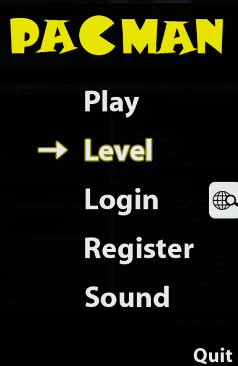

This Project is a 2D Game Java Game developed using Swing, Graphics APIs and Multithreading.

Technologies
-------------

`Java` `Swing API` `Graphics API` `Multithreading` `Photoshop`

### How to Run Project

1. Clone the repository in your local
2. Go to src > menu > `Main.java`
3. Run the Main Class
4. Alternatively you can also create a `Runnable Jar`
   1. Build
   2. Build Artifacts
   3. Build
   4. GAME.jar will be created in 
   `classes > artifacts > GAME_jar > GAME.jar`

### Project Screenshots

